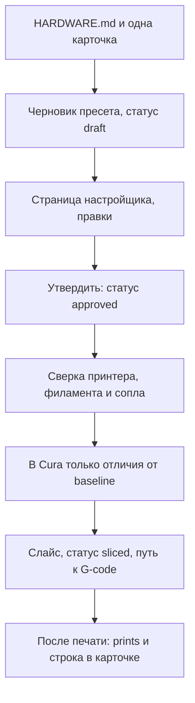

# Помощник настроек печати для Cura

Локальный помощник для **UltiMaker Cura**: подобрать параметры под конкретную деталь, разобрать дефект, не затереть профиль машины и только потом слайснуть STL.

Это не прошивка принтера и не репозиторий одной модели. Имя машины в [`printer_configs/HARDWARE.md`](printer_configs/HARDWARE.md) — железо, которое стоит сейчас. Стол, стартовый код и ретракт одной машины на другую не переносятся.

Слайсер здесь не свой. Режет Cura. Эта папка решает, **какие числа туда имеют право попасть** и **почему именно эти**.

## Какие задачи решает

| Задача | Как |
|---|---|
| Подобрать параметры под деталь | Одна карточка сценария из [`library/`](library/INDEX.md) плюс текущие сопло и филамент. Прошлый удачный слайс не копируется на другую геометрию. |
| Не смешать чужие рецепты | Машина, катушка и сопло — отдельные карточки. Заход на деталь только ссылается на них. |
| Разобрать дефект | Карточка симптома: что уже проверено на этом столе, что нельзя делать в ответ. |
| Утвердить настройки до Cura | Черновик JSON и страница настройщика. Пока статус не `approved`, в Cura ничего не уходит. |
| Восстановить профиль | Снимок рабочих cfg Cura 5.10 и правило, какие файлы нельзя затирать. |
| Слайснуть STL | После утверждения в Cura пишутся только ключи, которые отличаются от текущего профиля. Старт, конец и размер стола живой машины не меняются. |
| Запомнить, чем кончилась печать | Итог дописывается в тот же пресет. Удачный заход короткой строкой попадает в карточку. |

## Порядок одного захода



1. Читаются текущее железо и **одна** карточка под деталь или дефект. Нет сопла, материала или цели — вопрос, слайс не начинается.
2. Пишется `library/presets/<id>.json`. `baseline` — снимок профиля на этот момент. `settings` — предложение. Статус `draft`.
3. Человек открывает настройщик, правит числа и жмёт «Утвердить». Кнопка перезаписывает этот JSON: статус `approved`, в `settings` уже его правки. В чат и в Cura она ничего не отправляет.
4. Файл читается заново. Пока статус не `approved`, слайс запрещён.
5. Принтер, филамент и сопло сверяются с `HARDWARE.md`. Расхождение останавливает заход, пока смена железа не подтверждена. После подтверждения обновляется `HARDWARE.md`.
6. В живую Cura уходят только ключи, где `settings` отличается от `baseline`. Чужая машина из списка «Из Cura» в живой профиль не записывается.
7. После слайса статус становится `sliced`, в пресете лежит путь к G-code. Когда печать закончилась, в `prints` пишутся дата, итог (`success`, `partial` или `fail`) и заметка.

Ширины линий, толщина стенки и число стен считаются от **текущего** сопла. G-code, нарезанный под другой диаметр, этим соплом не печатается.

## Библиотека

Карточки в `library/` держат две полки и не смешивают их. Подробнее: [`library/README.md`](library/README.md).

- **Ориентир** — база из даташитов и обычной практики. На текущем принтере это ещё не гоняли.
- **У нас** — только то, что уже было на этом столе. Эта полка важнее гайда.

Индекс: [`library/INDEX.md`](library/INDEX.md).

Сценарии: первый слой, мелкий рельеф, большая видимая корка, силовая деталь, свесы, отверстия, тонкие стенки.  
Дефекты, уже виденные на печати: яма в центре крыши, заплывший рельеф, стёртый пруток на Bowden.  
Материалы: PLA / PLA+ и отдельная карточка PETG, чтобы её не копировали с PLA.

Железо в настройщике — отдельные JSON:

| Что | Где |
|---|---|
| Принтер: стол и стартовый код | [`library/machines/`](library/machines/) |
| Катушка: температуры, обдув, ретракт | [`library/filaments/`](library/filaments/) |
| Сопло и ширины линий | [`library/nozzles/`](library/nozzles/) |
| Конкретный заход и итог печати | [`library/presets/`](library/presets/) |

Импорт «Из Cura» берёт машину, катушку или диаметр сопла из установленной Cura 5.10. У чужого филамента копируются температуры и обдув. Ретракт проверенной машины не подменяется чужим. У импортированной машины берутся стол, стартовый и конечный код, ускорения и подачи. Ретракт, температуры и сопло из её определения не копируются. Такая карточка помечена как непроверенная и сама по себе на слайс не уходит.

## Настройщик

Локальная страница, слушает только этот компьютер.

```text
python tuner/server.py
```

Затем http://127.0.0.1:8765

Зависимостей нет: стандартная библиотека Python 3. Сервер отдаёт страницу и пишет JSON обратно в `library/`.

На странице:

- список пресетов и шапка «принтер / филамент / сопло»;
- каталог настроек Cura по группам, уровни «Базовые / Расширенные / Эксперт / Все», поиск и фильтр «только изменённые»;
- подсветка: предложение отличается от текущего профиля, либо правка ещё не записана в файл;
- «Сохранить правки» и «Утвердить»;
- заметка и журнал результата печати.

Подписи полей и уровни видимости лежат в [`tuner/fields.json`](tuner/fields.json).

Кнопка «Утвердить» не запускает слайс. Слайс делается в Cura после того, как пресет перечитан и статус в файле уже `approved`.

## Как числа попадают в Cura

Пока Cura 5.10 запущена и в ней жив плагин [CuraMCP](https://github.com/AuraFriday/cura_mcp), настройки можно записать в открытый профиль, не правя cfg руками. Инструмент называется `cura`. Его видит любой клиент, подключённый к локальному MCP-Link: Cursor, Claude Desktop, Antigravity и остальные. Клиент с Cura напрямую не говорит.

В профиль уходит разница `settings` и `baseline`. Стартовый код, конечный код и размер стола машины, которая сейчас открыта в Cura, этот шаг не меняет.

Установка — ниже. Исходник плагина в эту папку не кладётся: лицензия Aura Friday запрещает его распространять.

## Установка связи с Cura

Нужны три части. Проект поставляется без них.

1. **UltiMaker Cura 5.10** с сайта UltiMaker. Другая мажорная версия держит профиль в другой папке `%APPDATA%\cura\<версия>`.
2. **MCP-Link Server** с [релизов Aura Friday](https://github.com/AuraFriday/mcp-link-server/releases). Это локальный узел. Плагин Cura регистрирует на нём инструмент `cura`, а редактор агента подключается к узлу.
3. **Плагин CuraMCP** с [релиза cura_mcp](https://github.com/AuraFriday/cura_mcp/releases) или из маркетплейса Cura. Папку `CuraMCP` положить в `%APPDATA%\cura\5.10\plugins\` (macOS: `~/Library/Application Support/cura/5.10/plugins/`, Linux: `~/.local/share/cura/5.10/plugins/`).

После копирования в плагине три правки, без них на Cura 5.10 он не держит связь:

- В `plugin.json` в `supported_sdk_versions` должна быть строка `8.10.0`. Иначе Cura 5.10 плагин не загрузит. Апстрим рассчитан на 5.11+.
- В проверке регистрации успехом считать и текст `Successfully registered tool`, и JSON с полем `registered_name`. MCP-Link 1.3 отвечает JSON. Без этой проверки плагин отключается, вызовы падают с `Remote tool 'cura' disconnected before replying`.
- В начале `main_worker` направить stderr в `%APPDATA%\cura\5.10\cura_mcp_debug.log`. В Cura 5.10 нет Help → Show Console, это пункт 5.11+.

Перезапустить MCP-Link, затем Cura. В логе должны появиться `Connected` и регистрация инструмента `cura`.

Клиенту нужен тот же адрес и токен, которые выдал установщик MCP-Link. Порт и токен у каждой машины свои, в репозиторий их не копируют. Имя сервера может быть любым; у этой установки оно `mypc`. Инструмент внутри сервера называется `cura`.

Cursor и Claude Desktop принимают такой блок. Файл Cursor: `%USERPROFILE%\.cursor\mcp.json`. Файл Claude Desktop: `%APPDATA%\Claude\claude_desktop_config.json`. Установщик MCP-Link часто пишет его сам. Если запись уже есть, вторую не добавлять.

```json
{
  "mcpServers": {
    "mypc": {
      "url": "https://127-0-0-1.local.aurafriday.com:<порт>/sse",
      "headers": {
        "Authorization": "Bearer <токен установщика MCP-Link>"
      }
    }
  }
}
```

Antigravity тот же узел добавляет через панель агента: MCP Servers → Manage MCP Servers → View raw config. В новых версиях ключ адреса называется `serverUrl`, не `url`. Файл конфига — тот, который открыл этот пункт (`~/.gemini/config/mcp_config.json` или `%USERPROFILE%\.gemini\antigravity\mcp_config.json`).

Другой клиент подключается так же, если умеет удалённый MCP по SSE: адрес `/sse` и заголовок `Authorization`. Имя обёртки роли не играет. Пока Cura закрыта, инструмента `cura` в списке нет.

Отдельный `CuraEngine.exe slice` на полном наборе значений Cura здесь не используется: на пустых углах заполнения он падает. Резать через окно Cura или через тот же плагин.

Живые файлы профиля Cura перезаписываются при выходе программы. Ручную правку cfg делают, когда Cura закрыта. Куда какой файл класть: [`printer_configs/README.md`](printer_configs/README.md).

В снимке машины `quality_changes` оставлен пустым. Привязка кастомного профиля качества к экземпляру машины уже один раз заставляла Cura пересоздать принтер и стереть стартовый код.

## Что уже проверено

Снимок на 2026-09-21, пока в `HARDWARE.md` указан FlyingBear Tornado 2 Pro:

| | |
|---|---|
| Принтер | FlyingBear Tornado 2 Pro, FDM, Bowden, Marlin |
| Стол | 360 × 360 × 360 мм, подогрев |
| Слайсер | UltiMaker Cura 5.10.0, машина в Cura — Custom FFF printer |
| Филамент | 1.75 мм, eSUN PLA+ gray |
| Сопло | 0.6 мм |

На этом столе удачно напечатан мелкий рельеф: [`logo/logo_n06_gyroid50.gcode`](logo/logo_n06_gyroid50.gcode), пресет [`library/presets/logo_n06_gyroid50.json`](library/presets/logo_n06_gyroid50.json). Gyroid 50%, две стены, шесть верхних слоёв, flow кожи 100%, ретракт 3 мм / 25 мм/с. С него начинают похожие небольшие шайбы. На большую форму те же 50% на весь объём не переносят.

Большая форма в `kleshnya/` проверена частично: ориентация и отказ от плотного заполнения всего объёма, не весь сценарий. PETG на этом столе не печатали. Карточка 3DI D300 импортирована из каталога Cura и на слайс не отправляется, пока в `HARDWARE.md` стоит Tornado.

Три неудачные попытки того же рельефа лежат рядом с эталоном: редкая сетка дала дырки в крыше, лишний flow кожи закрыл дырки и заплыл рисунок. Карточки [`library/defects/roof_sag.md`](library/defects/roof_sag.md) и [`library/defects/flooded_contour.md`](library/defects/flooded_contour.md) фиксируют этот вывод. Файлы `logo_solid_top.gcode` и `CFFFP_logo.gcode` нарезаны под сопло 0.4.

## Состав папки

| Путь | Зачем |
|---|---|
| [`library/`](library/INDEX.md) | Сценарии, дефекты, материалы, машины, катушки, сопла, пресеты |
| [`tuner/`](tuner/server.py) | Страница утверждения перед слайсом |
| [`printer_configs/`](printer_configs/HARDWARE.md) | Текущее железо и снимок cfg Cura 5.10 |
| [`cura_backup/`](cura_backup/) | Более ранние cfg |
| [`logo/`](logo/) | Мелкий рельеф: эталон, неудачные G-code, фото |
| [`kleshnya/`](kleshnya/) | Большая форма |
| [`AGENTS.md`](AGENTS.md) | Те же правила, сформулированные для агента в редакторе |

`SESSION_2026-09-21.md` — история одной сессии, не пресет.
